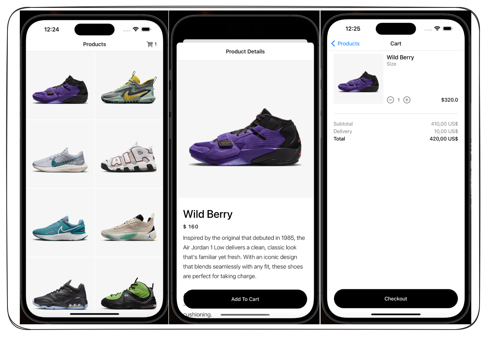

## Nike Ecommerce App
A modern e-commerce web application for browsing, searching, and purchasing Nike products. Built with React, it provides a smooth shopping experience with a responsive design, product filters, a dynamic shopping cart, and secure checkout.

Getting Started:
Follow these steps to set up and run the project locally:

Prerequisites:
Make sure you have the following installed:
Node.js
Git
Expo Go App: Install it from Google Play Store or Apple App Store.

Installation:

1-Clone the repository:
git clone https://github.com/your-username/nike-ecommerce-app.git
cd nike-ecommerce-app

2-Install dependencies:
npm install

3-Start the development server:
npm start

4-Use the QR code:
Scan the QR code displayed in the terminal or the browser with the Expo Go app on your phone.
Make sure your phone and computer are on the same Wi-Fi network.

Potential Features:

User Authentication: Allow users to sign up, log in, and manage their accounts.
Order History: Enable users to view past orders.
Wishlist: Let users save their favorite products for later.
Admin Dashboard: Manage inventory, orders, and user accounts.
Payment Integration: Integrate with Stripe or PayPal for seamless payments.
Enhanced Search: Add predictive search and filters for better navigation.
Mobile App: Extend functionality to a React Native mobile app.

